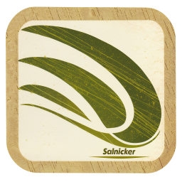

<!-- Last updated: 251128 -->

 

 

> The original Salnicker application can be found [here](https://github.com/APrettyCoolProgram/salnicker/tree/0.9.0)

# Salnicker

Salnicker is a class library that:

* Converts a file containing multiple SHA hashes into individual files
* Converts individual SHA hash files into a single file
